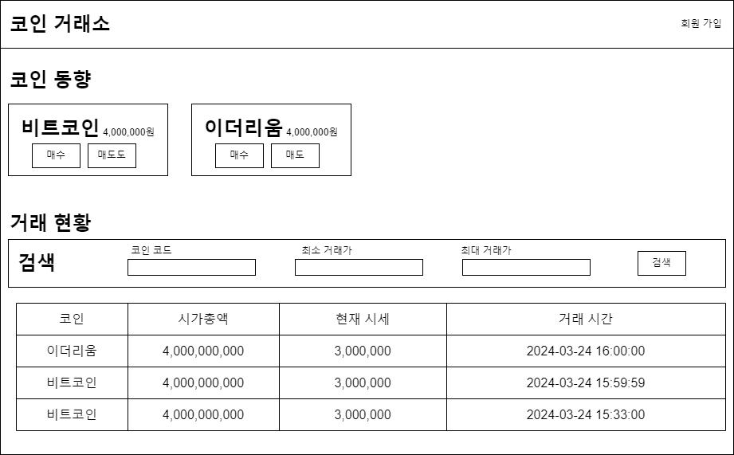
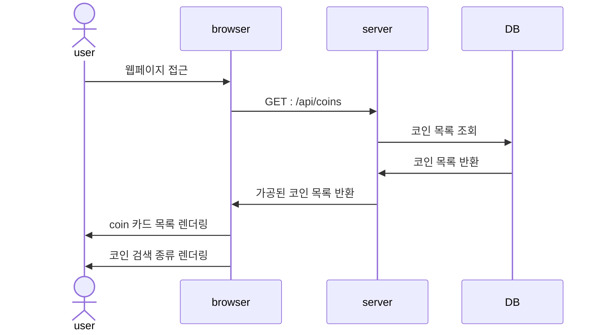
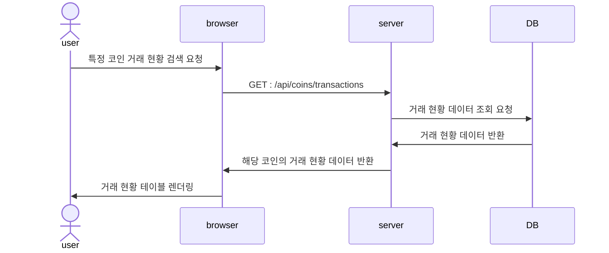
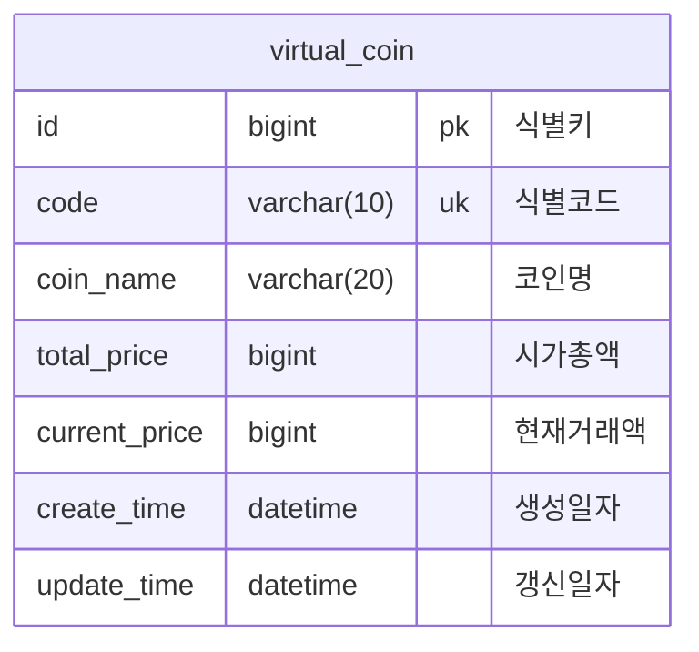

# simple-coin-market
간단 코인 거래소 만들기 with React

# 요구사항

- 거래소에서 거래 중인 코인 정보를 볼 수 있다.
    - 해당 코인에 대한 매수, 매도 요청이 가능하다.
- 코인 거래 이력을 볼 수 있다.
    - 최신순으로 출력된다.
- 코인 거래 이력을 검색할 수 있다.

# 서버 환경

## frontend

- node v20.12.2
- yarn 1.22.9
- React 18.2.0
- styled-components 6.1.8
- storybook 8.0.9

## backend

- java 17
- gradle
- spring-boot 3.2.7
    - configuration-processor
    - devtools
    - web
    - test
    - docker-compose
- postgresql, spring-data-jpa
- testcontainer
- lombok

# 메인화면 mockup

# API 명세

## /api/coins `GET`

마켓 내 존재하는 코인 목록 반환

## /api/coins/transactions `GET`

### params

- code : 코인 코드
- min : 최소 거래가
- max : 최대 거래가

## API 요청 흐름

### 코인 목록 조회 요청

### 거래 현황 검색 결과 요청

# ERD

